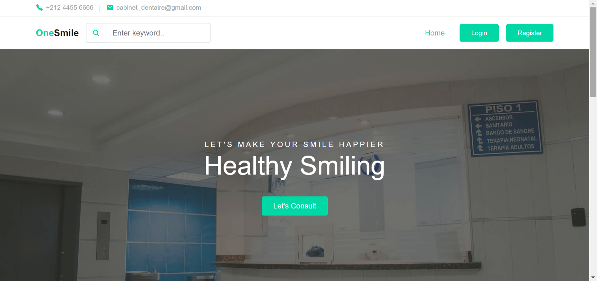
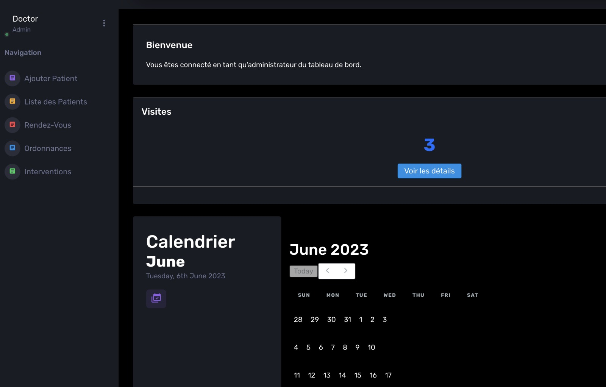
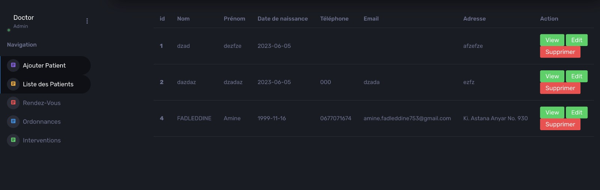
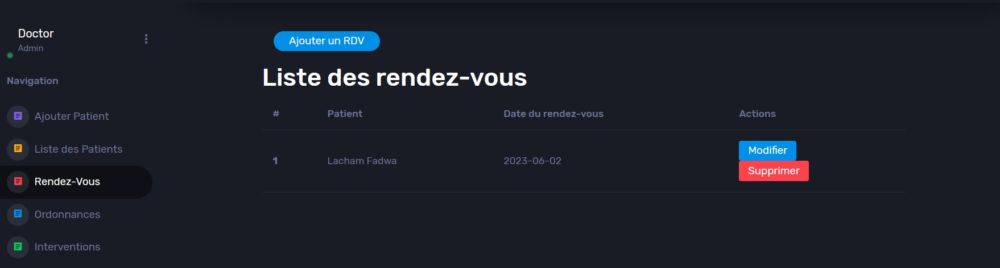
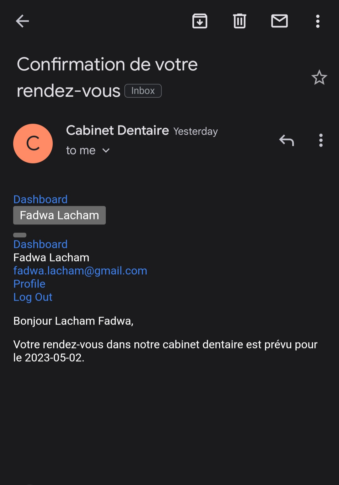
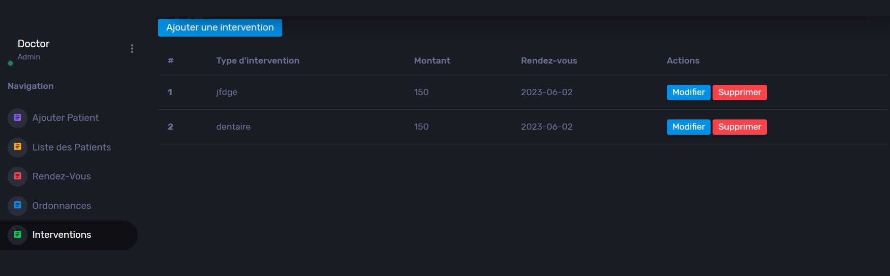
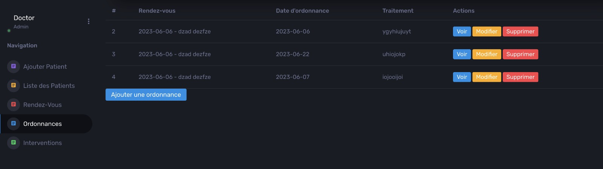

# 🦷 **One Smile : Dental Cabinet Management App**  
*Effortless dental practice management with just a few clicks!*

Welcome to the **Dental Cabinet Management App**, your one-stop solution for managing patients, appointments, interventions, and prescriptions. Built with **PHP**, **Composer**, and a dash of magic 🪄, this app is perfect for streamlining operations in any dental practice!

---

## 🎯 **Features at a Glance**
✨ **Secure Login/Registration** for both doctors and patients.  
✨ **Dynamic Dashboards** tailored for each user.  
✨ **Comprehensive Patient Management**: Add, edit, delete, and view detailed profiles.  
✨ **Streamlined Appointment Scheduling** with email confirmations.  
✨ **Intervention Tracker** to manage dental procedures.  
✨ **Prescription Generator**: Create, view, and download PDFs with ease.  

---

## 📸 **Screenshots**  
Here’s a sneak peek at what you’ll experience!  

### 🏠 **Home Page**  


### 🔑 **Login & Register**  
Secure login for doctors and patients.  


### 📊 **Doctor Dashboard**  
All essential tools at your fingertips!  


---

## 🛠️ **Key Modules**

### 👨‍⚕️ **Patient Management**  
- Add, update, delete, or view patient profiles effortlessly.  
- Access detailed information with just one click.  
  

---

### 📅 **Appointment Management**  
- Schedule and manage appointments for patients.  
- Automated email confirmations to keep everyone informed.  
  

  

---

### 🛠️ **Intervention Management**  
- Log dental procedures with ease.  
- Track intervention history or update existing records.  
  

---

### 📜 **Prescription Management**  
- Create and manage prescriptions.  
- Generate PDFs for easy distribution and download.  
  

---

## 🚀 **Quick Setup**

### Prerequisites  
Ensure you have the following installed:  
- **PHP 7.4+**  
- **Composer**  
- **MySQL**  

### Installation Steps  
1. Clone this repository:  
   ```bash
   git clone https://github.com/your-username/dental-cabinet-management.git
   ```
2. Navigate to the project directory:  
   ```bash
   cd dental-cabinet-management
   ```
3. Install dependencies using Composer:  
   ```bash
   composer install
   ```
4. Configure your database:  
   - Import the provided `database.sql` file.  
   - Update the `config.php` file with your database credentials.  
5. Run the local development server:  
   ```bash
   php -S localhost:8000
   ```
6. Open your browser and visit:  
   [http://localhost:8000](http://localhost:8000)

---

## 🌟 **Tech Stack**
- **PHP**: Backend logic.  
- **Composer**: Dependency management.  
- **MySQL**: Robust data storage.  
- **PHPMailer**: Sending secure emails.  
- **HTML & CSS**: Beautiful, user-friendly interfaces.  

---

## 🛡️ **Future Enhancements**
🌈 Add real-time **chat support** between doctors and patients.  
🌈 Integrate **billing and invoicing** modules.  
🌈 Enable advanced **analytics dashboards** for practice insights.  

---

## 📣 **Contributions Welcome!**
Have an idea to make this app even better? Submit a pull request or drop an issue in the tracker. We’d love your feedback!

---

<div align="center">
    <h3>💖 Thank You for Exploring! 💖</h3>
    <p>If you like this project, give it a ⭐ and share the love!</p>
    
</div>
```

